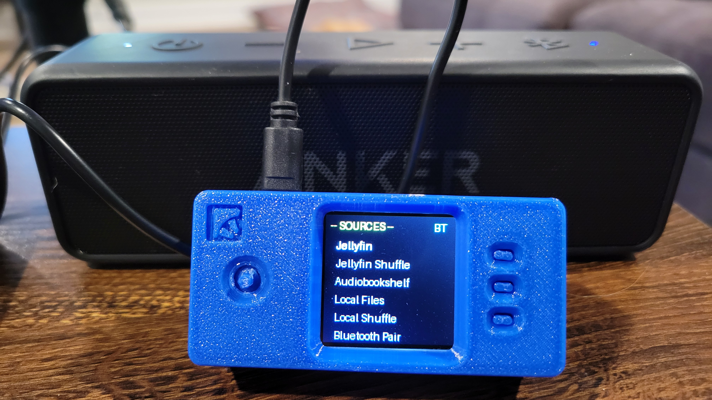

# MediaPI - Raspberry Pi Music Player

A portable music player for Raspberry Pi with support for multiple audio sources including Jellyfin, Audiobookshelf, and local files. Features a 1.44" LCD display, Bluetooth audio routing, and intuitive joystick controls.



## Features

- **Multi-Source Support**
  - Jellyfin (with shuffle option)
  - Audiobookshelf
  - Local audio files
  - Shuffle playback for all sources

- **Playback Controls**
  - Play/Pause toggle
  - Next/Previous track navigation
  - Forward/Backward skipping (30s forward, 15s backward)
  - Smart previous button (restart current track or go to previous based on elapsed time)
  - Auto-play next track when current finishes
  - Loop back to start when reaching end of playlist

- **Hardware Integration**
  - 1.44" LCD display (128x128) with status visualization
  - Joystick navigation (up/down/left/right/press)
  - Multi-button input support (PRESS, KEY1, KEY2, KEY3)
  - Bluetooth audio routing
  - Bluetooth device scanning and pairing

- **Bookmarking & Resume**
  - Automatic position saving every 15 seconds
  - Resume playback from last position when replaying a track
  - Bookmark indicator on display (*)

- **Progress Visualization**
  - Live progress bar during playback
  - Uses metadata duration when available (faster than waiting for audio player duration)

- **Web Server**
  - Built-in web interface for remote control (optional)

## Hardware Requirements

- **Raspberry Pi**: Pi Zero 2 W (recommended), Pi 4, or similar
- **Display**: [Waveshare 1.44" LCD HAT](https://www.waveshare.com/wiki/1.44inch_LCD_HAT?srsltid=AfmBOoqppbzVhhQBaLMlc1WAQhcLNHTrObki1UQcGMSaaRTbj-OkJhtu) with ST7735 controller
- **Case**: [SnapBox 3D printed case for Pi Zero with Waveshare LCD 1.44"](https://www.printables.com/model/302312-snapbox-raspberry-pi-zero-waveshare-lcd-144-resin)
- **Audio**: Bluetooth audio device (headphones, speakers, etc)
- **Input**: Joystick and buttons (integrated with LCD HAT)

## Installation

1. Clone the repository (on your Pi):
```bash
git clone https://github.com/SEary342/mediapi.git
cd mediapi
```

2. Install the service:
```bash
bash install.sh
```

3. Configure your sources in `.env` (get your api keys from Jellyfin and ABS):
```
# Jellyfin
JELLYFIN_URL=http://your-jellyfin-server:8096
JELLYFIN_API_KEY=your_api_key

# Audiobookshelf
ABS_URL=http://your-abs-server:80
ABS_API_KEY=your_api_key
ABS_LIB_ID=library_id
```

5. Reboot your Pi:
```bash
sudo reboot
```

6. If you are a developer, the ~/mediapi directory contains the application and `uv` manages the dependencies. You can run the app with `uv run player.py`. Note that the web server won't be accessible in this mode without changing the port in `server.py`.

## Controls

| Button | Action in BROWSER | Action in PLAYING | Action in MENU |
|--------|------------------|-------------------|---|
| **UP** | Scroll up | - | Scroll up |
| **DOWN** | Scroll down | - | Scroll down |
| **PRESS** | Play selected track | Play/Pause | Select option |
| **KEY1** | Back to menu | Back to menu | Back to menu |
| **KEY2** | Play selected track | Next track | Select option |
| **KEY3** | Play selected track | Restart or Previous* | Select option |
| **LEFT** | Jump to previous letter | Rewind 15s | - |
| **RIGHT** | Jump to next letter | Skip 30s | - |

\* KEY3: If track has been playing for less than 3 seconds, go to previous track. Otherwise, restart current track from beginning.

## Configuration

### Features Toggle

Enable/disable features in `app_config.py`:

```python
FEATURES = {
    "JELLYFIN": True,
    "ABS": True,
    "LOCAL": True,
    "BT_PAIR": True,
}
```

### Display Configuration

- Set `use_hardware=False` for testing without actual hardware
- Adjust display parameters in `display.py` for your specific LCD

### Bluetooth

- Auto-connects to the last paired Bluetooth device on startup
- Manual device scanning available via menu

## File Structure

```
.
├── player.py              # Main application
├── audio.py               # VLC audio playback
├── display.py             # LCD display driver
├── input.py               # Input handling (joystick/buttons)
├── bluetooth.py           # Bluetooth management
├── api_clients.py         # Jellyfin/Audiobookshelf API clients
├── local_library.py       # Local file management
├── storage.py             # Bookmark/state persistence
├── server.py              # Web server (optional)
├── app_config.py          # Configuration settings
├── utils.py               # Utility functions
└── templates/             # Web interface templates
```

## API Support

### Jellyfin
- Requires v10.11 API
- Streams audio directly from server
- Extracts duration metadata for accurate progress bar

### Audiobookshelf
- Uses library items API
- Supports streaming from configured library

### Local Files
- Supports: `.mp3`, `.m4a`, `.wav`
- Scans directory for available files
- Optional shuffle playback

## Logging

Logs are written to `mediapi.log` and stderr. Enable debug logging by adjusting `logging.basicConfig()` level in `player.py`.

## Troubleshooting

### Right seek doesn't work
- Ensure duration is valid (positive value)
- The seek logic will proceed without capping if duration isn't available

### Auto-play not triggering
- Check that `is_user_paused` flag is properly managed
- Auto-play only triggers when a track finishes naturally

### Bluetooth connection issues
- Check Bluetooth adapter is recognized
- Ensure target device is discoverable
- Review system logs for detailed error messages

## License

See LICENSE file for details

## Contributing

Contributions welcome! Please test thoroughly before submitting.
